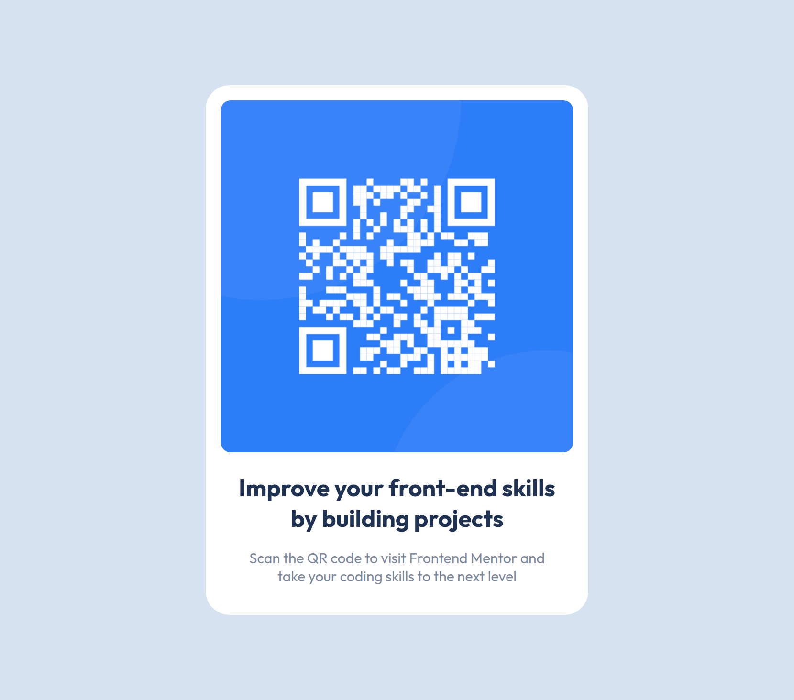

# Frontend Mentor - QR code component solution

This is a solution to the [QR code component challenge on Frontend Mentor](https://www.frontendmentor.io/challenges/qr-code-component-iux_sIO_H). Frontend Mentor challenges help you improve your coding skills by building realistic projects.

## Table of contents

- [Overview](#overview)
  - [Screenshot](#screenshot)
  - [Links](#links)
- [My process](#my-process)

  - [Built with](#built-with)

- [Author](#author)

## Overview

### Screenshot

### Links

- Solution URL: [Github Repo](https://github.com/hectorgarcia07/FEM-QR-Page)
- Live Site URL: [Github Pages](https://hectorgarcia07.github.io/FEM-QR-Page/)

## My process

### Built with

- Semantic HTML5 markup
- Flexbox
- Mobile-first workflow

## Author

- Github - [Github](https://github.com/hectorgarcia07)
- Frontend Mentor - [@hectorgarcia07](https://www.frontendmentor.io/profile/hectorgarcia07)
- Twitter - [@jdbjfl](https://www.twitter.com/jdbjfl)
